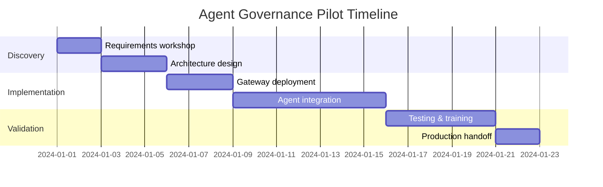

# Agent Governance Pilot

Get from **"compliance won't sign off"** to **"deployed in production"** in 2-4 weeks.

**Fixed-fee pilot:** $15,000 - $25,000
**Duration:** 2-4 weeks from kickoff

---

## What You Get

We implement UAPK Gateway for **one high-value workflow** and deliver a production-ready deployment with all the governance, approvals, and audit trails you need.

### Deliverables

#### :material-file-document: Production Manifest
UAPK Manifest defining agent boundaries, policies, budgets, and escalation rules

#### :material-server-network: Deployed Gateway
Running UAPK Gateway instance on your infrastructure (self-hosted VM or cloud)

#### :material-link-variant: Integrated Agents
Your agent(s) connected via API, calling `/v1/gateway/evaluate` and `/execute`

#### :material-account-check: Approval Workflows
Human-in-the-loop approvals configured for high-risk actions (web UI + API)

#### :material-file-certificate: Evidence-Grade Logs
Tamper-evident interaction records with verified chain integrity

#### :material-export: Compliance Bundle
Sample audit log export formatted for regulators and auditors

#### :material-school: Operator Training
2-hour training session for your operators (approve/deny, export logs, verify chain)

#### :material-book-open: Documentation
Runbooks, troubleshooting guides, and production deployment checklist

---

## 3-Phase Approach

### Phase 1: Discovery & Design (Week 1)

**Activities:**
- Requirements workshop (2-3 hours)
- Map agent roles, actions, and tools
- Define policy rules and escalation thresholds
- Design approval workflows
- Document compliance requirements (SOC2, GDPR, internal audit)

**Deliverables:**
- UAPK Manifest (draft)
- Integration architecture document
- Success criteria and acceptance tests

---

### Phase 2: Implementation (Week 2-3)

**Activities:**
- Deploy UAPK Gateway to your infrastructure
- Configure authentication (JWT + API keys)
- Integrate target agent(s) via API or SDK
- Implement connectors (HTTP, webhook, custom tools)
- Configure approval workflows (web UI + API)
- Set up tamper-evident logging with hash chaining
- Deploy to staging environment

**Deliverables:**
- Running UAPK Gateway instance (staging)
- Integrated agent(s)
- Active UAPK Manifest
- Approval workflow (UI + API)
- Interaction logs with verified chain

---

### Phase 3: Validation & Handoff (Week 3-4)

**Activities:**
- End-to-end testing (happy path + edge cases)
- Security review (secrets, API keys, connector allowlists)
- Performance validation (latency, throughput)
- Operator training (2-hour session)
- Documentation review
- Production deployment planning

**Deliverables:**
- Test results and performance benchmarks
- Compliance export bundle
- Operator runbook
- Production deployment checklist
- 30 days post-pilot bug fixes

---

## Success Criteria

Pilot is considered successful when:

- ✅ Target agent(s) integrated and calling gateway APIs
- ✅ UAPK Manifest active with policy enforcement (ALLOW/DENY/ESCALATE)
- ✅ Approval workflow tested and operational
- ✅ Tamper-evident logs verified (chain integrity check passes)
- ✅ Compliance export bundle generated and reviewed
- ✅ Operators trained and able to manage approvals
- ✅ Production deployment plan approved

---

## What We Need From You

#### Access
To your target AI agent(s) and integration endpoints

#### Infrastructure
1 VM (2 vCPU, 4GB RAM) + PostgreSQL for UAPK Gateway deployment

#### Subject Matter Experts
2-4 hours/week for requirements and testing

#### Stakeholders
Approval workflow owners for training and UAT

---

## Pricing & Payment

**Fixed Fee:** $15,000 - $25,000 (based on complexity and agent count)

**Payment Schedule:**
- 50% upon SOW signature (project kickoff)
- 50% upon successful completion and acceptance

**What's Included:**
- All deliverables listed above
- Dedicated solutions engineer
- Weekly sync calls (30-60 minutes)
- Operator training (2-hour session)
- 30 days post-pilot bug fixes

**Not Included (optional add-ons):**
- Custom connectors beyond HTTP/webhook (priced separately)
- Extended training (beyond 2 hours)
- Ongoing support after 30-day period (see [Enterprise Support](pricing.md#3-enterprise-support))
- Compliance consulting (e.g., SOC2 audit prep)

---

## Timeline

**Typical timeline:** 2-4 weeks from kickoff to production-ready

---

## Typical Pilot Scope

#### Agents
1-3 AI agents

#### Workflows
1-2 approval workflows

#### Integrations
1 integration (e.g., Slack notification)

#### Operators
2-4 trained operators

**Additional agents or workflows beyond this scope may require a change order.*

---

## Post-Pilot Options

### Option 1: Self-Managed (Open Source)
Continue with the self-hosted deployment independently:
- Apache-2.0 license (fully open)
- Community support via GitHub
- You own the infrastructure and deployment
- No recurring fees

### Option 2: Enterprise Support
Transition to ongoing support contract:
- Custom connectors (Salesforce, M365, etc.)
- SLA (4-hour response, 99.9% uptime)
- Version upgrades and security patches
- Pricing: $3K-$10K/month based on scale

[Learn More →](pricing.md#3-enterprise-support){ .md-button }

---

## FAQ

??? question "What if we have multiple workflows to govern?"
    The pilot focuses on **one** high-value workflow to prove value quickly. After success, you can expand to additional workflows either independently (open-source) or through additional engagements.

??? question "Can we start with a blueprint instead of a full pilot?"
    Yes. Our [Blueprint Package](pricing.md#2-uapk-blueprint-package) ($5K-$10K) delivers the design and architecture first. Then you can choose to implement yourself or proceed to a full pilot.

??? question "What if the pilot doesn't meet our objectives?"
    We work closely to ensure success. If objectives aren't met, there's no obligation to continue. We define success criteria upfront to ensure alignment.

??? question "Can we deploy on-premise?"
    Yes. Pilots support both cloud and on-premise deployments. We work with your infrastructure team to deploy where you need it.

??? question "Do you sign NDAs and MSAs?"
    Yes. We accommodate most standard enterprise procurement processes including NDAs, MSAs, and custom SOWs.

??? question "What happens after the 30-day bug fix period?"
    You can self-manage (open-source) or transition to an Enterprise Support contract for ongoing maintenance and features.

---

## Use Cases

Pilots have been successfully completed for:

- **Legal:** Settlement negotiation agents, takedown notice automation
- **Finance:** Trading execution gates, KYC onboarding agents
- **Compliance:** Vendor due diligence agents, risk screening automation
- **Customer Support:** Refund approval agents, escalation triage

See our [47ers Library](../47ers.md) for pre-built templates.

---

## Get Started

Ready to deploy UAPK Gateway in your environment?

**Step 1:** Schedule a 30-minute discovery call
- Discuss your use case and requirements
- Review technical architecture
- Confirm pilot scope and timeline

**Step 2:** Receive proposal
- Custom pilot plan
- Fixed-fee pricing
- SOW ready for signature

**Step 3:** Kickoff within 1 week
- Start Discovery phase
- Weekly sync calls
- Production deployment in 2-4 weeks

**Contact:** [mail@uapk.info](mailto:mail@uapk.info)

**Response time:** 24 hours for pilot inquiries

---

## Related

- [Pricing Overview](pricing.md) - All engagement options
- [Enterprise Overview](index.md) - Use cases and customer stories
- [Support Options](support.md) - Ongoing support details
- [Quickstart](../quickstart.md) - Self-host the open-source version
