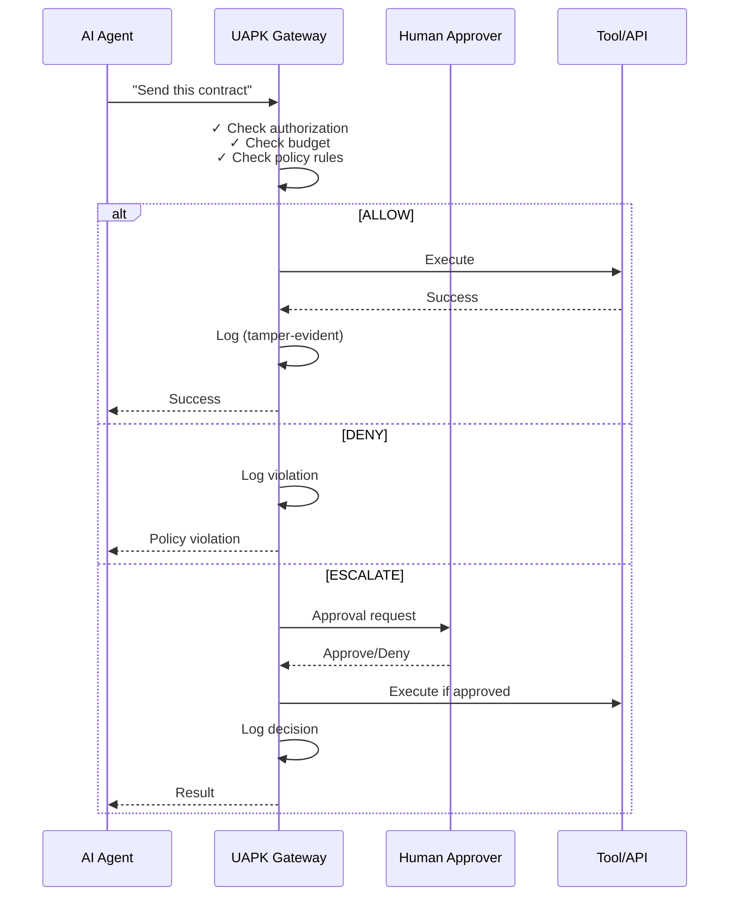

# Ship Autonomous AI Agents
## Without Creating a Compliance Nightmare

Deploy AI agents with **hard guardrails**, **human approvals**, and **evidence-grade audit logs** that satisfy regulators and courts.

[Start Pilot Program →](pilot.md){ .md-button .md-button--pilot }
[View GitHub →](https://github.com/UAPK/gateway){ .md-button }

---

## The Problem

Your team built an AI agent that could:

- Onboard customers (KYC/AML checks)
- Triage insurance claims
- Execute trades or approve transactions
- Send customer communications
- Update CRMs and case systems

**But compliance won't sign off.**

Why? Because they're asking questions you can't answer:

### "Who authorized this?"
Attribution and accountability

### "Can we stop it at runtime?"
Kill switches and intervention

### "Can we prove what happened?"
Evidence-grade audit trails

### "How do we audit this later?"
Compliance and regulatory reporting

---

## The Solution: UAPK Gateway

**A non-bypassable control plane for AI agent actions.**

Think of it as:

| Component | Function |
|-----------|----------|
| **Firewall** | Policy enforcement at the action boundary |
| **Black Box Recorder** | Tamper-evident audit logs for every decision |
| **Kill Switch** | Human approvals for high-risk actions |
| **Budget Control** | Rate limits and spend caps per agent |

**Deploys on one VM. Self-hosted. No vendor lock-in.**

---

## How It Works (30 Seconds)

**Key principle:** Agents **propose** actions. Gateway **enforces** policy. Tools run with **gateway credentials**, not agent credentials.

---

## What You Get

### :material-shield-check: Policy Enforcement
Define what agents can/can't do (UAPK Manifest). Hard limits on budgets, rates, and scopes. Risk hooks for external review.

### :material-account-check: Human Approvals
Escalate high-risk actions to operators. Web UI + API for approval workflows. Audit trail of every decision.

### :material-file-certificate: Tamper-Evident Logs
Every action produces an immutable interaction record. Hash-chained log with gateway signatures. Export bundles for auditors.

### :material-key-variant: Capability Tokens
Scoped delegation (time-limited, action-limited). Prevents "agent drift". Cryptographically signed and verifiable.

### :material-server: Production-Ready
FastAPI + PostgreSQL (proven stack). Docker Compose deployment (one VM). Health checks, metrics, backups. Self-hosted.

### :material-flash: Fast Deployment
Production-ready in 2-4 weeks with our pilot program. Fixed-fee pricing. No hourly billing.

---

## Who This Is For

### ✅ You should care if:

- You're shipping agents in **finance, legal, or compliance** environments
- You need a **governance story** to close enterprise deals
- Compliance keeps blocking your agent deployments
- You need **evidence-grade audit trails** for regulators or courts

### ❌ You probably don't need this if:

- Your agents only do research/summarization (no actions)
- You're in early prototyping (not production yet)
- You're fine with vendor-hosted logs and no auditability

---

## Pricing & Engagement

### Open Source
**Free (Apache-2.0)**

Self-host UAPK Gateway on your infrastructure

[Get Started →](../quickstart.md){ .md-button }

### Agent Governance Pilot
**$15,000 - $25,000** (2-4 weeks)

We implement UAPK Gateway for one high-value workflow

**Deliverables:**
- Production-ready manifest + guardrails
- Self-hosted gateway on your infrastructure
- Approvals flow + evidence-grade logs
- Compliance export bundle
- Operator training

[Learn More →](pilot.md){ .md-button .md-button--pilot }

### Enterprise Support
**$3K - $10K/month**

Ongoing support for production deployments

[Contact Us →](mailto:mail@uapk.info){ .md-button }

---

## Why Now?

**Agentic AI is moving from demos to production.**

- OpenAI Swarm, Anthropic MCP, LangChain agents are shipping to customers
- Enterprise buyers want agents but need **governance, audit, and control**
- Compliance teams are the new gatekeepers
- UAPK Gateway gives you the "yes, but safely" answer

**Model vendors will improve tool-calling.** But they won't solve:

- Non-bypassable enforcement at your boundary
- Organization-owned evidence (not vendor retention logs)
- Cross-model, cross-vendor governance standards

---

## Risk Mitigation

??? question "What if agents just bypass the gateway?"
    **Answer:** In production, tools run with credentials **controlled by the gateway**. Agents don't have direct access. This is enforced at the infrastructure level.

??? question "What if the gateway becomes a bottleneck?"
    **Answer:** Designed for < 100ms p99 latency. Horizontal scaling supported (multi-instance + shared Postgres). Most actions are async (approval flows don't block the agent).

??? question "What if we need custom connectors?"
    **Answer:** Open connector framework. We provide HTTP, webhook, and mock out of the box. Custom connectors are part of the pilot or support engagement.

??? question "What if compliance requirements change?"
    **Answer:** Policies are versioned and stored in manifests. Update the manifest, re-activate, and the new rules apply immediately. Full history is logged.

---

## Next Steps

### 1. Schedule a 30-minute discovery call

We'll discuss:
- Your agent use cases
- Compliance requirements
- Integration points
- Pilot scope and timeline

### 2. Technical review (optional)

Our solutions team reviews your architecture and provides:
- Integration feasibility assessment
- Security and compliance notes
- Recommended pilot approach

### 3. Pilot proposal

We deliver:
- Custom pilot plan
- Timeline and deliverables
- Pricing (fixed-fee, no surprises)

### 4. Kickoff in < 1 week

Pilots start fast. Most customers go live in 2-4 weeks.

---

## Contact

**Commercial inquiries:**

- **Email:** [mail@uapk.info](mailto:mail@uapk.info)
- **GitHub:** Open an issue labeled `commercial` at [https://github.com/UAPK/gateway/issues](https://github.com/UAPK/gateway/issues)

**Open source:**

- **Repo:** [https://github.com/UAPK/gateway](https://github.com/UAPK/gateway)
- **Docs:** See `docs/` directory
- **License:** Apache-2.0 (self-hostable, no strings attached)

---

## The Pitch in One Sentence

**UAPK Gateway lets you deploy autonomous AI agents with the guardrails, audit trails, and kill switches that compliance teams demand — self-hosted, on one VM, in production in 2-4 weeks.**

---

[:material-rocket-launch: Start Pilot](pilot.md)
[:material-currency-usd: View Pricing](pricing.md)
[:material-book-open-variant: Read Docs](../index.md)
[:material-github: View Source](https://github.com/UAPK/gateway)

---

*This is a commercial offering built on open-source foundations. The code is Apache-2.0. The support, connectors, and blueprints are how we make money. Transparent by design.*
