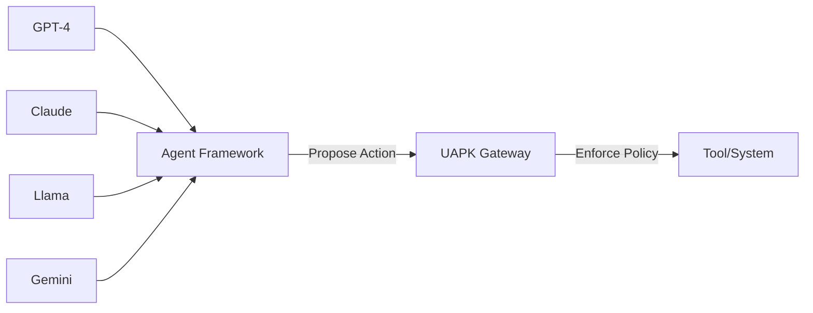

# Why UAPK Won't Be Obsolete

**Model vendors will improve. Your governance requirements won't change.**

---

## The Core Problem Doesn't Go Away

UAPK Gateway solves a **governance problem**, not a model problem:

### :material-gavel: Legal Requirements
"Who authorized this action?"

Model improvements won't eliminate the need for **attribution** and **accountability**

### :material-stop-circle: Runtime Control
"Can we stop it if needed?"

Better models don't reduce the need for **kill switches** and **approval workflows**

### :material-file-certificate: Evidence Requirements
"Can we prove this in court?"

Improved reasoning doesn't replace **tamper-evident audit logs** and **chain of custody**

### :material-shield-alert: Compliance Mandates
"How do we meet SOC2/GDPR?"

Smarter agents increase (not decrease) the need for **policy enforcement** and **audit trails**

---

## Model-Agnostic by Design

UAPK Gateway is **model‑agnostic** and **vendor‑agnostic**:

### It Governs Actions, Not Reasoning

**The gateway sits at the boundary to real systems**, not inside the model:
- It doesn't care how the agent reasoned
- It only cares what action is being attempted
- It enforces policy consistently across all models

---

### Vendor Improvements We Welcome

| Model Vendor Feature | UAPK Gateway Response |
|---------------------|----------------------|
| Better tool-calling APIs | ✅ Easier integration |
| Improved reasoning traces | ✅ Better policy inputs |
| Built-in safety features | ✅ Defense in depth |
| Native audit logging | ❌ **Not a replacement** |

**Why vendor logs aren't enough:**
- **Retention:** Vendor controls how long logs are kept
- **Ownership:** You don't own the evidence
- **Portability:** Can't transfer logs to a new vendor
- **Verification:** No tamper-evident chain, no cryptographic proof
- **Compliance:** Vendor logs don't meet regulatory requirements for organization-owned evidence

---

## What Regulated Orgs Still Need (Forever)

### 1. Non-Bypassable Enforcement

**The Problem:** Agents (or humans) might circumvent controls

**UAPK Solution:**
- Tools run with **gateway credentials**, not agent credentials
- Agents **can't bypass** the gateway to access tools directly
- Infrastructure-level enforcement (not just "please follow policy")

**Why this won't change:** Regulation requires controls to be **non-bypassable**. "The model is really good at following instructions" doesn't satisfy SOC2/ISO27001/HIPAA.

---

### 2. Organization-Owned Evidence

**The Problem:** Vendor-retained logs don't meet legal/compliance requirements

**UAPK Solution:**
- You own the infrastructure
- You own the database
- You own the audit logs
- Logs are cryptographically verifiable (hash chain + signatures)
- Export to any format (PDF, JSON, SIEM)

**Why this won't change:** Legal proceedings and audits require **organization-controlled evidence**. "Check the OpenAI logs" doesn't work in court.

---

### 3. Cross-Model Governance

**The Problem:** Different models, different vendors, inconsistent controls

**UAPK Solution:**
- Single governance layer for all agents
- Same policies apply to GPT-4, Claude, Llama, etc.
- Consistent audit trail format
- One place to manage approvals

**Why this won't change:** As organizations adopt multiple models (and they will), they need **consistent governance** across vendors. Each vendor having their own control plane is a nightmare for compliance.

---

### 4. Audit and Retention Control

**The Problem:** Vendor determines log retention policies

**UAPK Solution:**
- You control retention periods (30 days, 7 years, whatever you need)
- Immutable logs (hash-chained, can't be deleted)
- Export bundles for regulators
- Offline verification scripts

**Why this won't change:** Compliance regimes (SOC2, HIPAA, GDPR) mandate specific retention and audit requirements. You can't outsource this to a model vendor.

---

## The Vendor's Role vs. Your Role

| Responsibility | Model Vendor | You (with UAPK) |
|----------------|--------------|-----------------|
| **Reasoning quality** | ✅ Vendor's job | - |
| **Tool-calling API** | ✅ Vendor's job | - |
| **Safety fine-tuning** | ✅ Vendor's job | - |
| **Policy enforcement** | ❌ Vendor can assist | ✅ **Your control** |
| **Approval workflows** | ❌ Not vendor's job | ✅ **Your control** |
| **Audit logging** | ⚠️ Vendor logs exist | ✅ **Your evidence** |
| **Retention** | ⚠️ Vendor decides | ✅ **Your decision** |
| **Compliance** | ❌ Vendor can't certify you | ✅ **Your responsibility** |

**Vendors will make better models. You still own governance.**

---

## Real-World Examples

### Example 1: Multi-Model Strategy

**Scenario:** You start with GPT-4, then switch to Claude for cost, then add Llama for on-prem workloads.

**Without UAPK:**
- Reimplement policy checks for each model
- Different audit log formats
- Inconsistent approval workflows
- Compliance nightmare

**With UAPK:**
- Same policies apply to all models
- Single audit trail format
- One approval workflow
- Seamless governance

---

### Example 2: Vendor Outage

**Scenario:** OpenAI API is down. You need to prove what your agents did yesterday for a legal case.

**Without UAPK:**
- "Sorry, check with OpenAI when they're back up"
- No access to logs
- Can't verify actions
- Legal exposure

**With UAPK:**
- Full audit trail in your database
- Cryptographically verifiable
- Export to PDF for court
- No dependency on vendor uptime

---

### Example 3: Regulatory Audit

**Scenario:** SEC wants to audit your AI-driven trading agent for the last 2 years.

**Without UAPK:**
- Vendor may only keep 90 days of logs
- No proof of policy enforcement
- Can't verify chain of custody
- Fail audit

**With UAPK:**
- 2 years of tamper-evident logs
- Proof of policy enforcement at every action
- Cryptographic chain verification
- Export bundle for auditor
- Pass audit

---

## Technology Trends We Expect

### Trend 1: Model Quality Improvements
**Impact on UAPK:** ✅ Positive (easier to integrate, better reasoning)
**Impact on governance need:** ➡️ No change (still need controls)

### Trend 2: Vendor-Provided Safety Features
**Impact on UAPK:** ✅ Positive (defense in depth)
**Impact on governance need:** ➡️ No change (vendor features don't meet compliance requirements for organization-owned controls)

### Trend 3: Better Tool-Calling APIs
**Impact on UAPK:** ✅ Positive (simpler integration)
**Impact on governance need:** ➡️ No change (more capable tools increase need for governance)

### Trend 4: Multi-Model Adoption
**Impact on UAPK:** ✅ Positive (cross-model governance becomes critical)
**Impact on governance need:** ⬆️ **Increases** (need consistent governance across vendors)

### Trend 5: Agentic AI in Regulated Industries
**Impact on UAPK:** ✅ Positive (more customers)
**Impact on governance need:** ⬆️ **Increases** (regulation drives demand for non-bypassable controls)

---

## The Unfashionable Truth

**Model quality is a vendor's competitive advantage.**
**Governance is your legal requirement.**

These are **orthogonal concerns**:
- OpenAI winning the reasoning race doesn't eliminate your need for approvals
- Anthropic's constitutional AI doesn't replace your audit trail
- Google's best safety features don't satisfy SOC2 auditors asking "where's **your** evidence?"

**UAPK Gateway is infrastructure** (like a firewall or database). It's not trying to be smarter than the models. It's trying to be the **non-bypassable enforcement point** that regulated orgs legally require.

---

## Summary: What Won't Change

✅ **You need non-bypassable enforcement**
✅ **You need organization-owned evidence**
✅ **You need cross-model governance**
✅ **You need configurable approval workflows**
✅ **You need compliance-grade audit trails**
✅ **You need budget and rate controls**

Model vendors will make progress on reasoning, tool-calling, and safety. **You'll still need UAPK Gateway** (or something like it) because the governance requirements aren't going away.

---

## Related

- [Architecture Overview](../architecture/overview.md) - How UAPK Gateway works
- [Security & Compliance](../security/index.md) - Compliance features
- [Threat Model](../security/threat-model.md) - Security design
- [Pilot Program](../business/pilot.md) - Get started with expert help
