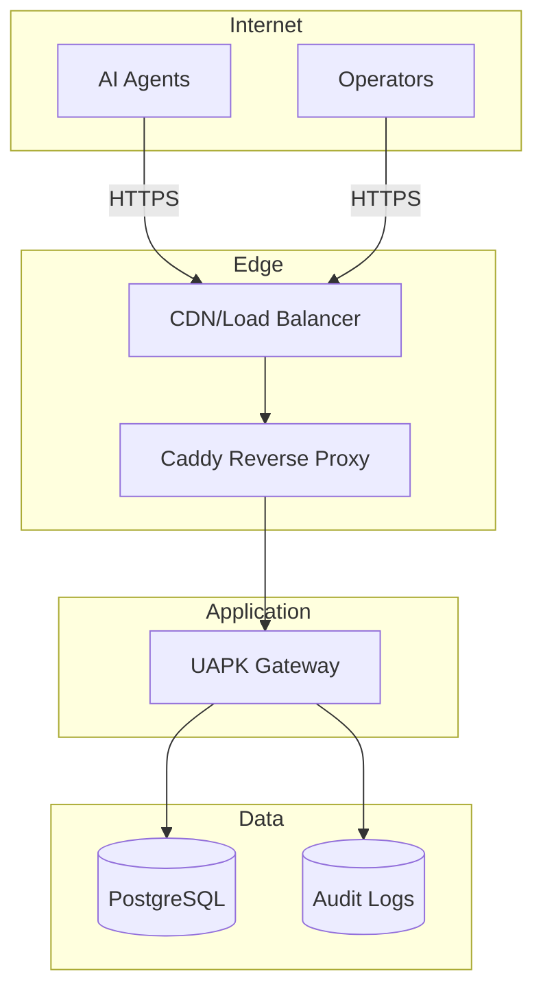
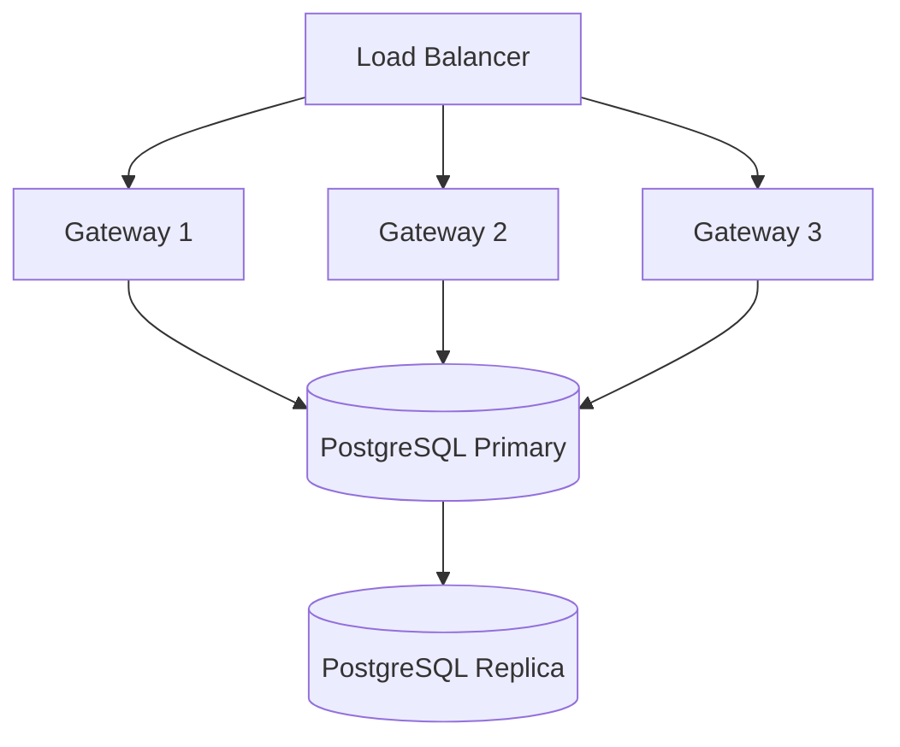

# Deployment

This guide covers deploying UAPK Gateway to production environments.

## Deployment Options

<div class="grid cards" markdown>

-   :material-server: **Single VM**

    ---

    Simple deployment on a single virtual machine

    [:octicons-arrow-right-24: Single VM](single-vm.md)

-   :material-shield-lock: **Caddy (Recommended)**

    ---

    HTTPS reverse proxy with automatic certificates

    [:octicons-arrow-right-24: Caddy Setup](caddy.md)

-   :material-database-export: **Backups**

    ---

    Database and configuration backup strategies

    [:octicons-arrow-right-24: Backups](backups.md)

-   :material-chart-line: **Monitoring**

    ---

    Observability and alerting setup

    [:octicons-arrow-right-24: Monitoring](monitoring.md)

</div>

## Architecture Overview



## Quick Start (Docker Compose)

For development and testing:

```bash
# Clone repository
git clone https://github.com/UAPK/gateway.git
cd gateway

# Start services
docker compose up -d

# Check status
docker compose ps
```

## Production Requirements

### Hardware

| Component | Minimum | Recommended |
|-----------|---------|-------------|
| CPU | 2 cores | 4+ cores |
| RAM | 4 GB | 8+ GB |
| Disk | 20 GB SSD | 100+ GB SSD |

### Software

| Component | Version |
|-----------|---------|
| Linux | Ubuntu 22.04+ or Debian 12+ |
| Docker | 24.0+ |
| PostgreSQL | 15+ |
| Python | 3.11+ (if not using Docker) |

### Network

| Port | Service | Access |
|------|---------|--------|
| 443 | HTTPS | Public |
| 80 | HTTP (redirect) | Public |
| 8000 | Gateway API | Internal |
| 5432 | PostgreSQL | Internal |

## Configuration

### Environment Variables

```bash
# Core settings
GATEWAY_HOST=0.0.0.0
GATEWAY_PORT=8000
GATEWAY_ENV=production

# Database
DATABASE_URL=postgresql://user:pass@db:5432/uapk_gateway

# Security
SECRET_KEY=your-256-bit-secret-key
GATEWAY_SIGNING_KEY_FILE=/etc/uapk-gateway/keys/signing.pem

# Logging
LOG_LEVEL=INFO
LOG_FORMAT=json

# Optional
GATEWAY_APPROVAL_EXPIRY_HOURS=24
GATEWAY_MAX_CONNECTIONS=100
```

### Configuration File

```yaml
# config.yaml
server:
  host: 0.0.0.0
  port: 8000
  workers: 4

database:
  url: postgresql://user:pass@db:5432/uapk_gateway
  pool_size: 20

security:
  signing_key_file: /etc/uapk-gateway/keys/signing.pem
  token_expiry_hours: 1

logging:
  level: INFO
  format: json
  output: stdout
```

## Deployment Checklist

### Pre-Deployment

- [ ] Generate signing key pair
- [ ] Configure secrets management
- [ ] Set up PostgreSQL database
- [ ] Configure TLS certificates
- [ ] Set up monitoring/alerting
- [ ] Document runbook

### Deployment

- [ ] Deploy database first
- [ ] Run database migrations
- [ ] Deploy gateway application
- [ ] Configure reverse proxy
- [ ] Verify health checks
- [ ] Test API endpoints

### Post-Deployment

- [ ] Verify log chain initialization
- [ ] Create initial organization
- [ ] Set up backup schedule
- [ ] Configure monitoring alerts
- [ ] Document deployment details

## High Availability

For high availability, deploy multiple gateway instances:



### Considerations

| Component | HA Strategy |
|-----------|-------------|
| Gateway | Multiple instances behind load balancer |
| Database | Primary-replica with failover |
| Signing Key | Shared via secrets manager |
| Sessions | Stateless JWT tokens |

## Troubleshooting

### Common Issues

| Issue | Check |
|-------|-------|
| Connection refused | Firewall rules, service status |
| Database errors | Connection string, permissions |
| TLS errors | Certificate validity, chain |
| Auth failures | Token expiry, key configuration |

### Health Check

```bash
# Check gateway health
curl http://localhost:8000/api/v1/gateway/health

# Check database connection
docker compose exec gateway python -c "from app.db import engine; engine.connect()"
```

## Related

- [Single VM](single-vm.md) - Detailed single VM setup
- [Caddy](caddy.md) - HTTPS configuration
- [Backups](backups.md) - Backup procedures
- [Monitoring](monitoring.md) - Observability setup
