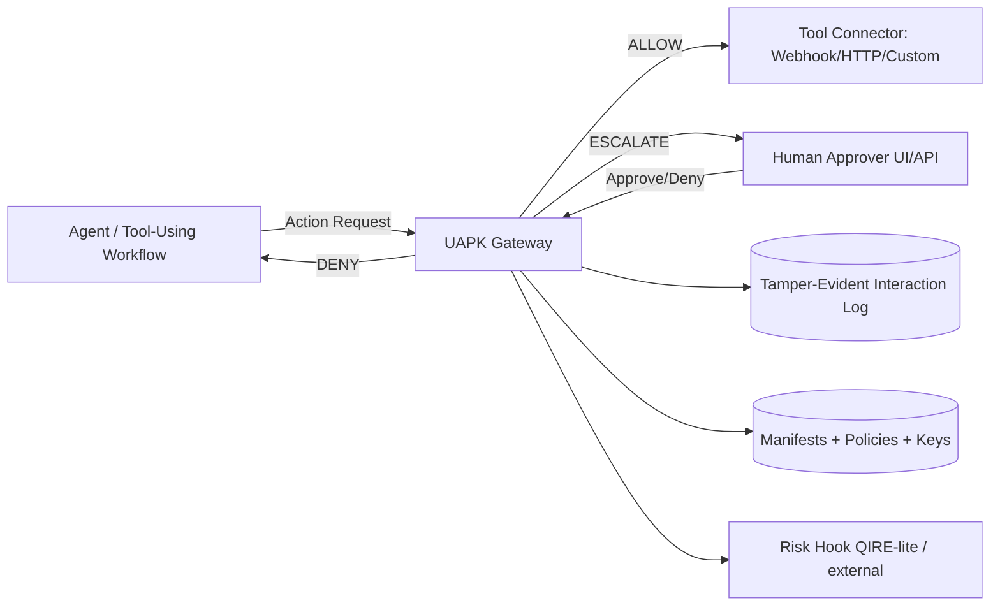

<style>
.md-content__button {
  display: none;
}
</style>

<div class="hero" markdown>
# UAPK Gateway

**The agent firewall + black box recorder for high‑stakes AI.**

Deploy autonomous AI agents with **hard guardrails**, **human approvals**, and **tamper‑evident audit logs** — on **one VM**, self‑hosted.

[Start Pilot Program :material-rocket-launch:](business/pilot.md){ .md-button .md-button--pilot }
[Self-Host (Open Source) :material-download:](quickstart.md){ .md-button .md-button--primary }
[View on GitHub :material-github:](https://github.com/UAPK/gateway){ .md-button }
</div>

> Agents don't "do" things directly. They **propose actions**.
> UAPK Gateway enforces **policy, permissions, budgets, risk hooks**, and produces **evidence‑grade interaction records** for auditors, regulators, and courts.

---

## Why this exists

Agentic AI is moving from "chat" to "action":

- Sending emails and messages
- Writing into CRMs and case systems
- Onboarding customers (KYC)
- Underwriting and claims triage
- Proposing trades / executing workflows

The moment agents touch **money, legal outcomes, privileged systems, or regulated data**, organizations hit the same wall:

<div class="feature-grid" markdown>

<div class="feature-card" markdown>
### :material-help-circle: "Who authorized this?"
Attribution and accountability for agent decisions
</div>

<div class="feature-card" markdown>
### :material-stop-circle: "Can we stop it at runtime?"
Real-time intervention and kill switches
</div>

<div class="feature-card" markdown>
### :material-file-certificate: "Can we prove what happened?"
Evidence-grade audit trails for legal proceedings
</div>

<div class="feature-card" markdown>
### :material-shield-alert: "How do we deploy safely?"
Compliance without blocking innovation
</div>

</div>

**UAPK Gateway is a control plane for agent actions** — designed for **legal, finance, and compliance** environments.

---

## The Solution

UAPK Gateway is a **single deployable service** (FastAPI + Postgres) that sits between agents and the outside world.



**Key design principle:** the gateway is the **non-bypassable enforcement point**. In production, tools run with credentials controlled by the gateway — not by the agent.

---

## What You Get

<div class="feature-grid" markdown>

<div class="feature-card" markdown>
### :material-shield-check: Policy Enforcement
ALLOW / DENY / ESCALATE decisions based on manifests, budgets, and risk hooks
</div>

<div class="feature-card" markdown>
### :material-key-variant: Capability Tokens
Scoped delegation with time limits, action allowlists, and cryptographic signatures
</div>

<div class="feature-card" markdown>
### :material-currency-usd: Budgets & Rate Caps
Per-day, per-entity limits to prevent runaway costs and abuse
</div>

<div class="feature-card" markdown>
### :material-account-check: Human Approvals
Escalate high-risk actions to operators via web UI or API
</div>

<div class="feature-card" markdown>
### :material-file-sign: Tamper-Evident Logs
Hash-chained, signed interaction records with verification scripts
</div>

<div class="feature-card" markdown>
### :material-package-variant: Compliance Exports
Audit bundles for regulators, auditors, and legal proceedings
</div>

<div class="feature-card" markdown>
### :material-connection: Connector Framework
Webhooks, HTTP, and custom tools with strict allowlists
</div>

<div class="feature-card" markdown>
### :material-server: Production-Ready
Docker Compose deployment on one VM, self-hosted, no vendor lock-in
</div>

</div>

---

## Who It's For

### Teams shipping "agentic" workflows

- **Law firms and litigation boutiques** (IP enforcement, claims, settlements)
- **Banks, fintechs, and insurers** (KYC/onboarding, underwriting, internal copilots)
- **Compliance and risk teams** trying to approve agent deployments
- **AI product teams** who need a **governance story** to close enterprise deals

### If you're in any of these situations, you're the target

!!! quote ""
    "Our agent can do X, but compliance won't sign off."

!!! quote ""
    "We need approvals for certain actions."

!!! quote ""
    "We need audit trails that survive scrutiny."

!!! quote ""
    "We want to deploy agents, but safely and repeatably."

---

## Quick Start

=== "Self-Host (Open Source)"

    ```bash
    # Clone and start
    git clone https://github.com/UAPK/gateway.git
    cd gateway
    make dev

    # Set up database
    make migrate
    make bootstrap

    # Open dashboard
    open http://localhost:8000
    ```

    See the [Quickstart Guide](quickstart.md) for complete instructions.

    **License:** Apache-2.0 (fully open source)

=== "Commercial Pilot"

    Get expert help to deploy UAPK Gateway for one high-value workflow in 2-4 weeks.

    **Includes:**
    - Production-ready manifest + guardrails
    - Self-hosted gateway on your infrastructure
    - Approvals flow + evidence-grade logs
    - Compliance export bundle
    - Operator training

    **Pricing:** $15,000 - $25,000 (fixed fee)

    [Learn More →](business/pilot.md){ .md-button .md-button--pilot }

---

## Why UAPK Won't Be Obsolete

UAPK Gateway is **model‑agnostic** and **vendor‑agnostic**:

- It governs **actions** at the boundary to real systems
- It integrates with your existing IAM, secrets, logging, and approvals
- It produces **organization‑owned evidence** (not vendor-retention logs)

Model vendors can improve tracing and tool primitives — but regulated orgs still need:

- **Non-bypassable enforcement** at your boundary
- **Consistent cross-model governance** standards
- **Audit and retention** under your own policies

See [Future-Proof Architecture](concepts/future-proof.md) for details.

---

## The "47ers" Library

Pre-built templates ready to deploy as micro-services:

- **Legal:** Settlement gate, takedown gate
- **Compliance:** KYC onboarding gate, vendor due diligence gate
- **Finance:** Trading execution gate
- **General:** Outbound email guard

See the [47ers Library](47ers.md) for all templates.

---

## Core Concepts

| Concept | Description |
|---------|-------------|
| [**UAPK Manifest**](concepts/manifest.md) | JSON document defining an agent's identity, capabilities, and policies |
| [**Capability Token**](concepts/capabilities.md) | Signed tokens that delegate scoped authority with limits |
| [**Policy Decision**](concepts/decisions.md) | ALLOW, DENY, or ESCALATE based on policy evaluation |
| [**Approval Workflow**](concepts/approvals.md) | Human review process for escalated actions |
| [**Interaction Record**](concepts/logs.md) | Tamper-evident audit log with hash chaining + signatures |

---

## Architecture

| Component | Technology |
|-----------|------------|
| Backend | Python 3.12 + FastAPI |
| Database | PostgreSQL 16 |
| UI | Jinja2 + HTMX (server-rendered) |
| Auth | JWT for humans, API keys for machines |
| Deployment | Docker Compose (dev & production) |
| Signatures | Ed25519 |

See [Architecture Overview](architecture/overview.md) for details.

---

## Status

**Version 0.1.0** - Production-ready core infrastructure.

- [x] Multi-tenant organizations and users
- [x] UAPK manifest validation and storage
- [x] Capability token issuance (Ed25519 JWT)
- [x] Policy engine with ALLOW/DENY/ESCALATE
- [x] Approval workflow with UI and API
- [x] Tamper-evident audit logs with verification
- [x] Operator dashboard
- [x] Docker Compose deployment
- [x] 47ers template library

See the [Roadmap](roadmap.md) for planned features.

---

## License & Support

- **Open Source:** Apache-2.0 — self-host for free
- **Commercial Pilots:** Fixed-fee engagements for fast deployment
- **Enterprise Support:** Custom connectors, SLA, compliance tuning

**Contact:** [mail@uapk.info](mailto:mail@uapk.info)

---

<div class="quick-links" markdown>
[:material-rocket-launch: Quickstart](quickstart.md)
[:material-briefcase: Enterprise](business/index.md)
[:material-book-open-variant: Concepts](concepts/index.md)
[:material-api: API Reference](api/index.md)
[:material-security: Security](security/index.md)
</div>
